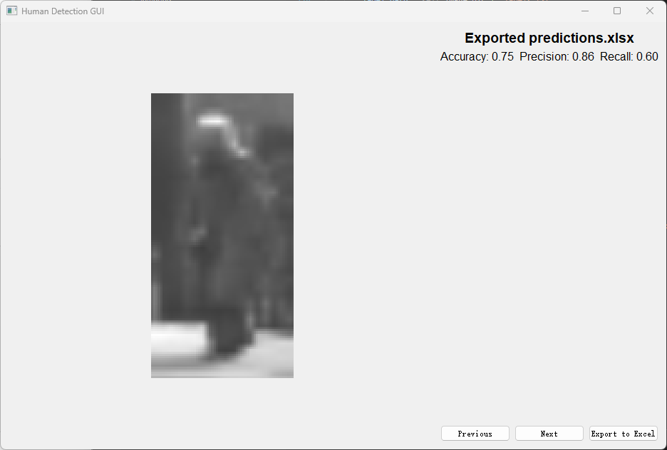

# CITS4402 Research Project

This repository contains the source code and report for the Human Detection project using HOG + SVM.
The data set could be found following the link posted in my report, or the link here:
http://www.gavrila.net/Datasets/Daimler_Pedestrian_Benchmark_D/Daimler_Mono_Ped__Class__Bench/daimler_mono_ped__class__bench.html

This `README.md` file is to guide you through my project folder structure and how to run the GUI for checking my model's performance.

## Author
- Liweiwen Zhou (24100792)  
- Email: 24100792@student.uwa.edu.au
- GitHub Repository: https://github.com/WilliamZLee/CITS4402_Human-Detection-project (The project repository link is here)

## Project Folder Structure
- `Baseline.py` – baseline training using HOG+SVM  
- `ablation_bins.py` / `evaluate_bins.py` – ablation study on orientation bins  
- `ablation_blocksize.py` / `evaluate_blocksize.py` – ablation study on block size  
- `ablation_norm.py` / `evaluate_norm.py` – ablation study on normalization  
- `final_model.py` / `final_evaluate.py` – final trained model using best parameters  
- `GUI_test.py` – GUI interface to visualize predictions  
- `Testing Images/` – 20 test images + labels.txt used in GUI  
- `Others/` – cached features and trained model (`.npy` / `.pkl`) and all other scripts (`.py`) with the submitted version `.zip` file. 
- `Reference.bib` – reference used in the report  
- `CITS4402_Research_Liweiwen Zhou_24100792.pdf` – final LaTeX report

## Running Requirements
-   Python 3.11
-   `scikit-learn`, `scikit-image`, `joblib`, `pandas`, `PyQt5`

## How to Run
```bash
python GUI_test.py
```
## GUI Usage Instructions

Once the GUI is launched using `python GUI_test.py`, the interface will display one test image at a time. The layout includes:

- **Main Image Panel**: Shows the test image (from the `Testing Images/` folder).
- **Prediction Label**: Displays the prediction below the image:
  - `Human` (1) or `Non-Human` (0)
- **Button Functions**:
  - `Previous`: Go to the previous image
  - `Next`: Go to the next image
  - `Export to Excel`: Saves all predictions into `predictions.xlsx` in the root directory, and shows the evaluation accuracy, precision, and recall based on `labels.txt`

The exported Excel file will be used for final model testing and submission.

## GUI Preview

Below is a screenshot of the GUI in action after runs to the final image and excel been exported:




